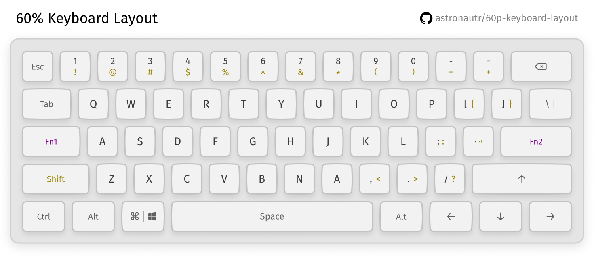
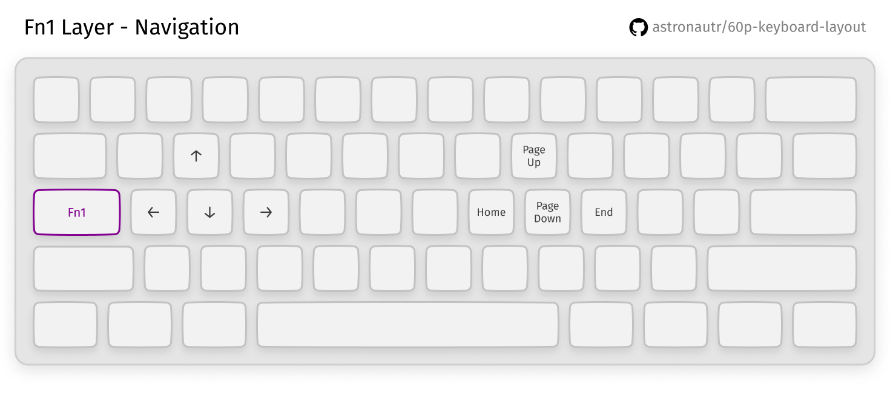
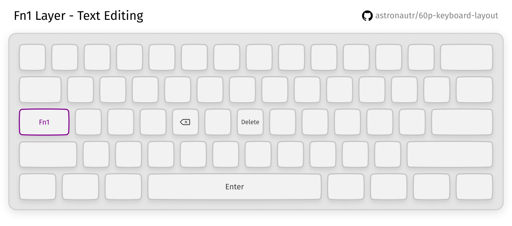
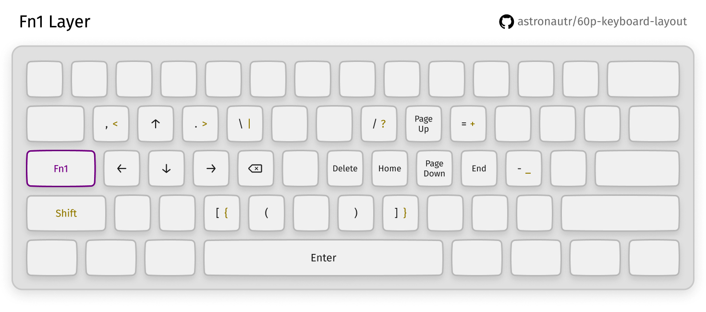
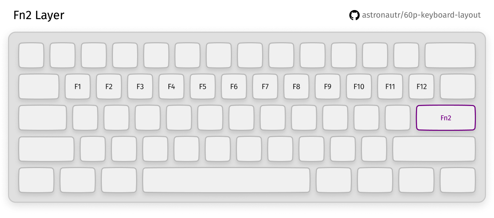

# Layout for a 60% keyboard

A guide that describes how to create a comfortable layout for a 60% keyboard.

In other languages: [Русский](./README_ru.md)

## Table of contents

* [Introduction](#introduction)
* [For whom](#for-whom)
* [Requirements](#requirements)
* [The Layout](#the-layout)
    * [Functional keys mapping](#functional-keys-mapping)
    <kbd>Fn1</kbd> <kbd>Fn2</kbd>
    * [Navigation keys mapping](#navigation-keys-mapping)
    <kbd>Up</kbd> <kbd>Down</kbd> <kbd>Left</kbd> <kbd>Right</kbd> <kbd>PageUp</kbd>
    <kbd>PageDown</kbd> <kbd>End</kbd> <kbd>Home</kbd>
    * [Text editing keys mapping](#text-editing-keys-mapping)
    <kbd>Backspace</kbd> <kbd>Delete</kbd> <kbd>Enter</kbd>
    * [Symbol keys mapping](#symbol-keys-mapping)
    <kbd>,&lt;</kbd> <kbd>.&gt;</kbd> <kbd>\\&#124;</kbd> <kbd>/?</kbd>
    <kbd>=+</kbd> <kbd>-_</kbd> <kbd>\`~</kbd> <kbd>\[\{</kbd>
    <kbd>\]\}</kbd> <kbd>\(</kbd> <kbd>\)</kbd>
    * [Additional keys mapping](#additional-keys-mapping)
    <kbd>F1</kbd>-<kbd>F12</kbd>
* [The Result](#the-result)   
* [Links](#links)

## Introduction

Most of the day I type: write code, chat in messengers, play video games. One day I realized I can't longer use my
bulky full-size keyboard. Its long usage literally brings me pain. Every time I need to press <kbd>Up</kbd>,
<kbd>End</kbd>, or any other key out of the home row (row of characters in the middle) I have to change the position
of my right hand and move it back after I finish. The same issues when using the mouse.

Transition to a 60% keyboard helped me to solve these issues - compact form-factor reduces the number of hands movements
during typing or navigation around the document to a minimum. It also reduces the distance between the home row and mouse, simplifying the transition between them. However, I don't have a medical education, and **I don't guarantee that this will improve your well-being**.

## For whom

* You're going to buy a keyboard and not sure if 60% layout will suit
* You already own such a keyboard and want to improve your layout

## Requirements

* Programmable 60% keyboard

For this guide, I'm going to use Anne Pro 2 in combination with [obinsKit](http://en.obins.net/obinskit).

[Layout for Anne Pro 2 and keys mapping table](#links).

## The Layout

Missing keys in this layout:

* <kbd>Right Shift</kbd>
* <kbd>Caps Lock</kbd>

### Functional keys mapping

First things first, we need to remap functional keys <kbd>Fn1</kbd> and <kbd>Fn2</kbd>. It's necessary for
convenient access to keys that unavailable on the main layer.

In my opinion, the most convenient way to do that is to map <kbd>Fn1</kbd> to the <kbd>Caps Lock</kbd> location and
<kbd>Fn2</kbd> to the <kbd>Enter</kbd> location. If you also move <kbd>Enter</kbd> to *tap layer* then it
will remain accessible - <kbd>Enter</kbd> will trigger if you tap on the key, <kbd>Fn2</kbd> will trigger if you press
the key and hold it. If that seems too extreme for you, then alternatively you can map <kbd>Fn2</kbd> to the <kbd>Right Shift</kbd> location.

[Table with functional keys mapping](./layout_table.md#functional-keys-mapping).
 
### Navigation keys mapping

Due to the close location of <kbd>Caps Lock</kbd> to <kbd>w</kbd> <kbd>a</kbd> <kbd>s</kbd> <kbd>d</kbd>,
<kbd>Fn1</kbd> + <kbd>w</kbd> key combination is very convenient for pressing <kbd>Up</kbd> with one hand.

Keys combination for the other arrow keys constructs similarly. Also, if you don't use keys in the lower right area
(originally I have <kbd>Right Shift</kbd>, <kbd>Fn1</kbd>, <kbd>Fn2</kbd>, and <kbd>Right Ctrl</kbd> there), then you
can put arrow keys there, so they and remain accessible on the main layer.

To press <kbd>PageUp</kbd> <kbd>PageDown</kbd> <kbd>End</kbd> <kbd>Home</kbd> you can use your right hand. For example,
use <kbd>Fn1</kbd> + <kbd>i</kbd> to press <kbd>PageUp</kbd> and similar key combos for other keys of this section.

[Table with navigation keys mapping](layout_table.md#navigation-keys-mapping)

### Text editing keys mapping

<kbd>Delete</kbd> and <kbd>Backspace</kbd> keys are pretty far from the home row on both full-size and 60% boards.
It's possible to fix it by moving them directly to the home row on <kbd>Fn1</kbd> layer.

[Table with text editing keys mapping](layout_table.md#text-editing-keys-mapping)

### Symbol keys mapping

I also decided to simplify access to symbol keys and move the most used symbols closer to the home row. This should
reduce the load on your pinky, which usually used to press at least 7 keys when using the 10 finger typing technique.

[Table with symbol keys mapping](layout_table.md#symbol-keys-mapping)

Here's the layout on <kbd>Fn1</kbd> layer after all of these changes:

### Additional keys mapping

To access <kbd>F1</kbd>-<kbd>F12</kbd> it's convenient to use a key combination of <kbd>q</kbd>-<kbd>]</kbd> with <kbd>Fn2</kbd>.

[Table with F1-F12 keys mapping](layout_table.md#additional-keys-mapping)

## The Result

  
:camera: Spoiler with all layers layouts

  
   
  
  
  
  
  

## Links

* [Keys mapping tables](layout_table.md)
* [Anne Pro 2 macOS layout profile](https://github.com/astronautr/60p-keyboard-layout/releases/download/v1.1.0/ap2_macOS.json)
* [Anne Pro 2 Windows layout profile](https://github.com/astronautr/60p-keyboard-layout/releases/download/v1.1.0/ap2_Windows.json)
* [Anne Pro 2 macOS alternative layout profile](https://github.com/astronautr/60p-keyboard-layout/releases/download/v1.1.0/ap2_macOS_alternative.json)
* [Anne Pro 2 Windows alternative layout profile](https://github.com/astronautr/60p-keyboard-layout/releases/download/v1.1.0/ap2_Windows_alternative.json)
